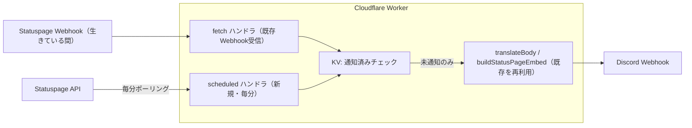

# Webhook受信の完全代替計画（Cloudflare Worker + 1分Cron）

> 2026-07-09 時点の計画メモ。**未実装**。実装着手時にこのメモを更新すること。

## 背景

- 2026-07-08 深夜（JST 07-09 2:34）、Statuspage 経由で「Test Incident」通知を受信。VRChat が通知設定を変更・テストしていた形跡。
- その後、status.vrchat.com の「Subscribe to Updates」から**メール / Webhook の購読タブが消滅**（残っているのは Twitter とサポートサイトへのリンクのみ）。
- 現在の Webhook 購読はまだ生きているが、**切れたら再登録する手段がない**。
- Statuspage 側がプッシュ配信を閉じた以上、真のプッシュ受信の復元は不可能。最も近い代替は「Worker 自身が Statuspage API を1分毎に差分チェックする」方式。

## 方針

既存の `worker/index.js` に `scheduled` ハンドラ（Cron）を追加し、**日本語化・embed 生成パイプラインを完全に再利用**する。通知の見た目は Webhook 時代と同一になる。遅延は最大60秒程度。

- Webhook 受信（`fetch` ハンドラ）は生きている限り併存させる
- KV による「通知済み管理」で二重通知を防ぐ
- Webhook が死んでも何もせず Cron 側が自動的に全通知を引き継ぐ

## データソース

毎分、以下の2エンドポイントを取得する（どちらも認証不要の公開API）。

| エンドポイント | 用途 |
|---|---|
| `https://status.vrchat.com/api/v2/incidents.json` | 障害（直近50件、resolved 含む） |
| `https://status.vrchat.com/api/v2/scheduled-maintenances.json` | メンテナンス（scheduled / in_progress / verifying / completed 含む） |

`unresolved.json` + 「リストから消えたら復旧扱い」（GitHub Actions 版のロジック）は使わない。
履歴込みのエンドポイントなら **resolved / completed も最終更新の本文つきで取得でき**、消滅検知が不要になるため。

## 差分検出と通知済み管理（KV）

- KV キー `poll_state` に「incident_id → 最新の `incident_updates[0].id` と status」のマップを保存
- 各ポーリングで API の最新状態と比較し、**update id が変わったインシデントだけ**通知対象にする
- 通知送信前に KV キー `notified:<incident_id>:<update_id>` の有無を確認（存在すれば送らない）
  - Webhook 受信側（`fetch` ハンドラ）にも同じチェック＆書き込みを追加する。これが二重通知防止の本体
- 通知後に `notified:...` キーを書き込み（TTL 30日程度で自動掃除）

### 無料枠の制約（重要）

| リソース | 無料枠 | 消費見込み |
|---|---|---|
| Workers リクエスト | 10万/日 | Cron 1,440/日 + Webhook 若干 |
| Cron Trigger | 5個/アカウント | 1個（`* * * * *`） |
| KV 読み取り | 10万/日 | 約1,500/日 |
| KV 書き込み | **1,000/日** | 変化時のみ書く設計なら数件/日 |
| Workers AI | 10,000ニューロン/日 | 現行同等（辞書ヒット時ゼロ） |

**`poll_state` は差分があったときのみ書き込むこと。** 毎分書くと KV 書き込み無料枠（1,000/日）を超過する。
CPU 制限（無料 10ms/呼び出し）も JSON パース中心なら問題なし。

## 実装タスク（着手時）

1. `worker/index.js` に追加:
   - `scheduled(event, env, ctx)` ハンドラ（2エンドポイント取得 → 差分検出 → 通知）
   - `buildStatusPageEmbed` はほぼそのまま流用（API のインシデント構造は Webhook ペイロードの `incident` と同形。`shortlink` / `incident_updates` / `components` / `scheduled_for` すべて含まれる）
   - フッターを発生源で区別: Webhook 経由は現行どおり `(Webhook)`、Cron 経由は `(Polling)` 等
   - `fetch` ハンドラに `notified:` チェック＆書き込みを追加（二重通知防止）
   - 1回のポーリングで複数通知が出る場合は古い順に送る
2. Cloudflare 設定（ダッシュボード）:
   - KV namespace を作成し、変数名 `KV` でバインド
   - Settings → Triggers → Cron Triggers に `* * * * *` を追加
   - コード貼り替えデプロイ（wrangler CLI は設定を消す恐れがあるためダッシュボード推奨。CLI 移行するなら先に wrangler.toml を整備）
3. 動作確認:
   - 本番 Discord へのテスト送信はしない
   - 直近の実イベント（**2026-07-14 21:00 JST 開始の Database Maintenance**）で、Webhook 併存中に二重通知が出ないこと・Cron 単独でも通知が組み立てられること（ログで確認）をチェック

## 関連する保留事項

- `WEBHOOK_SECRET`（偽装POST対策）: コードは実装済み・**未設定のまま保留**。設定すると既存 Webhook 購読が 404 になり、再購読手段がない今は通知が完全停止するため。Cron 移行が完了して Webhook 購読を捨てる決断をしたら、設定して `fetch` ハンドラを実質封鎖してよい
- GitHub Actions ポーリング（`main.py` / `check_status.yml`）: 2026-05-25 から手動無効化中。本計画の完成後は完全に役割を失うため、リポジトリ整理時に削除を検討
- `worker/health-monitor.js`: 本計画とは無関係（VRChat API の死活監視）。停止中のまま
